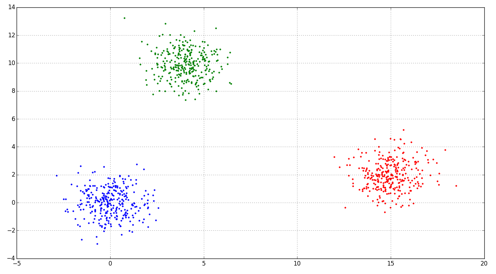
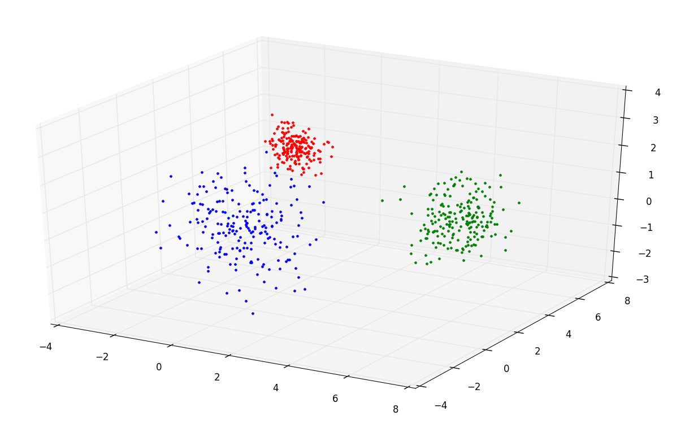
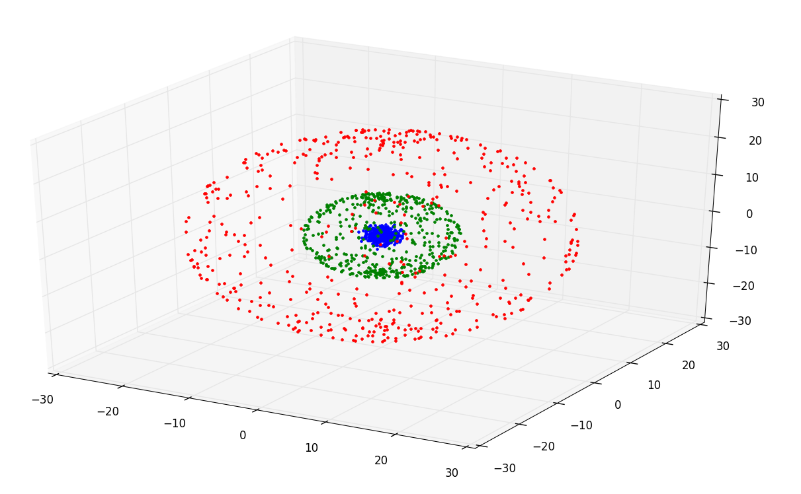

# Cluster generation

## Description
In a nutshell, cluster analysis is analys of similar data objects. Here's examples cluster generation.
>cluster_test.py

>cluster_circle.py

>cluster_test_3d.py

>cluster_sphere_3d.py

We will use some examples in future projects for introducing in cluster analysis.

## Learn more

[-Wiki](https://en.wikipedia.org/wiki/Cluster_analysis)
[-What is cluster analysis?](https://en.wikipedia.org/wiki/Cluster_analysis)

## Installation

You can use [Python](https://www.python.org/) with data package: [Anaconda](https://www.anaconda.com/) or [Miniconda](https://conda.io/miniconda).
There's another way - use [Portable Python](http://portablepython.com/). Also you can use whatever IDE for Python.

## License

Free
