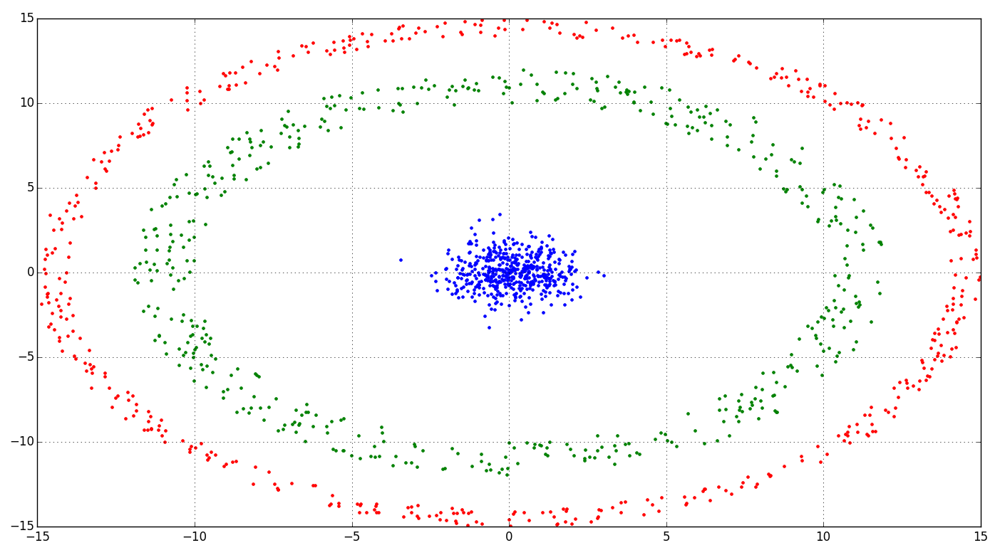

# Cluster generation

## Description
In a nutshell, cluster analysis is analys of similar data objects. Here's examples cluster generation.
>cluster_test.py

>cluster_circle.py

>cluster_test_3d.py

>cluster_sphere_3d.py


We will use some examples in future projects for introducing in cluster analysis.

## Code Example

It needs to create txt file of unity cluster data 
```python
unity=concatenate([clt1,clt2,clt3],axis=0)
indeces=random.permutation(unity.shape[0])
unity=unity.take(indeces,0)

savetxt('xxx.txt',unity)
```

## Knowledge

Objects have properties. We are going to consider measurable properties. We assume that all properties
has the same type (for example length, width, height). 
Now we need to group objects based on properties. Measure the differences helps. 
It's **distance**. The properties of the object is now a ***vector***.


## Learn more

Source 1: [Wiki](https://en.wikipedia.org/wiki/Cluster_analysis)
Source 2: [What is cluster analysis?](https://en.wikipedia.org/wiki/Cluster_analysis)

## Installation

You can use [Python](https://www.python.org/) with data package: [Anaconda](https://www.anaconda.com/) or [Miniconda](https://conda.io/miniconda).
There's another way - use [Portable Python](http://portablepython.com/). Also you can use whatever IDE for Python.

## License

Free
